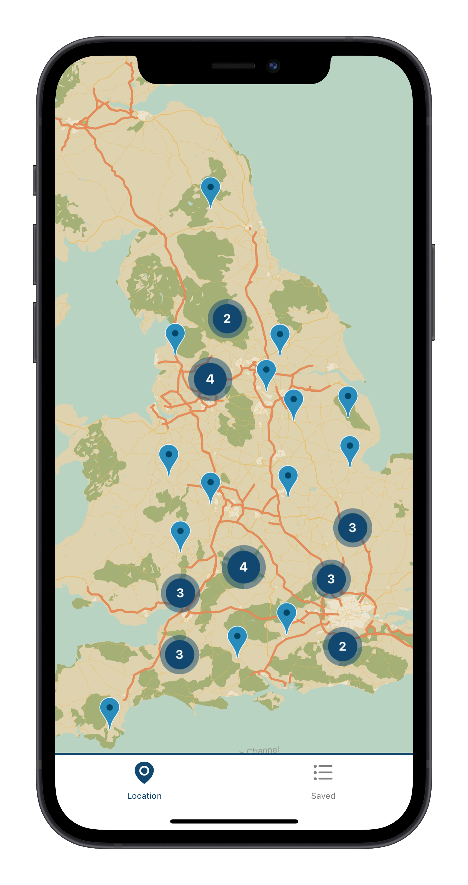
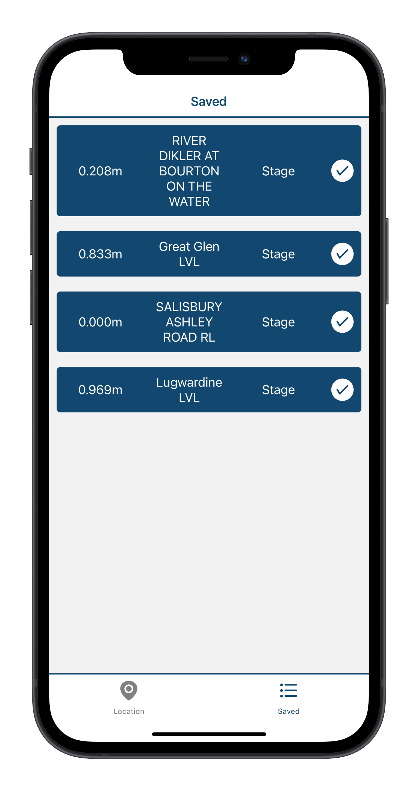

# Flow State

Flow state is an app designed for those who love watersports and need an easy, real time display of the waterlevels in the UK . Flow state now allows you to save your most frequently visited locations so that you can quickly gauge the waterlevels instead of searching for them on the map.

  

## Getting Started

In order to work on Flow State you will need a couple of things:

- [Expo](https://docs.expo.io/) -  the Expo development environment.

   `npm install -g expo-cli`

- Local [Mongodb](https://docs.mongodb.com/manual/installation/) database - To store static data

- IOS Device or [emulator](https://apps.apple.com/us/app/xcode/id497799835?mt=12)

## Installation

1. Clone this repo

   `git clone 'https://github.com/joedavies25/FlowState.git'`

2. Install dependancies

   `cd client`

   `npm install`

   `cd ../`

   `cd server`

   `npm install`

3. Scrape static data

   `npm run scraper` (make sure your mongodb is running)

4. Start server

   `npm start`

5. start client

   `npm start`

6. Connect to expo with ios emulator or with an ios phone and the [Expo App](https://apps.apple.com/gb/app/expo-go/id982107779)

